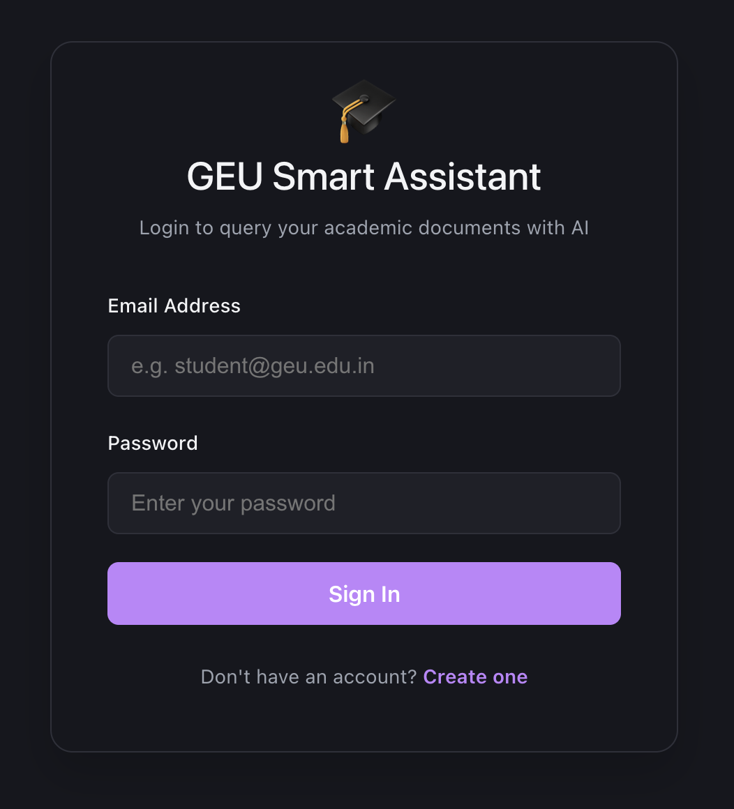
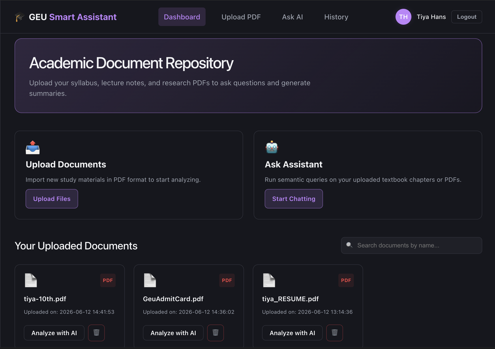
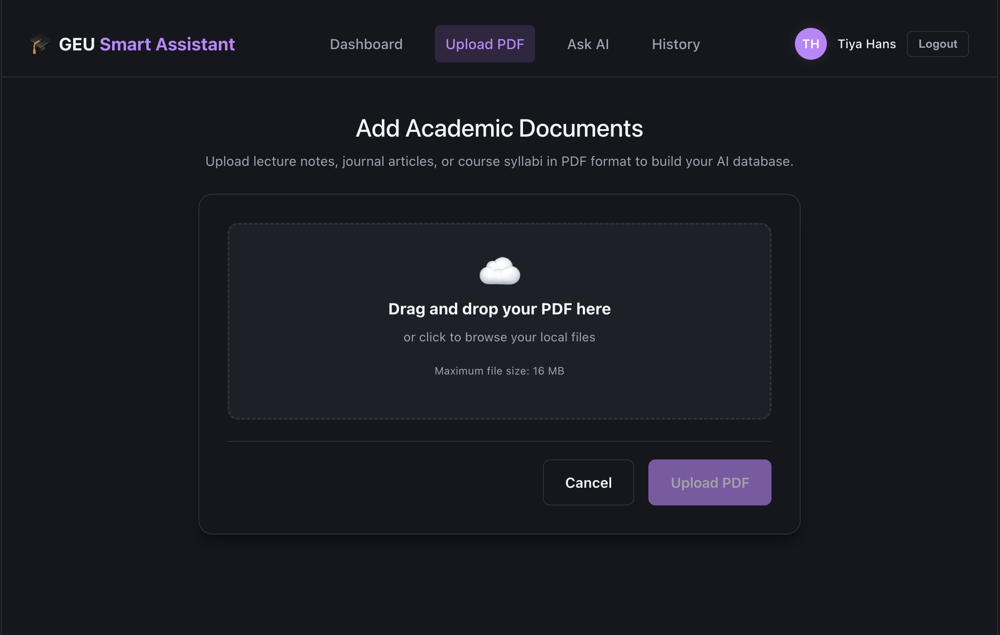
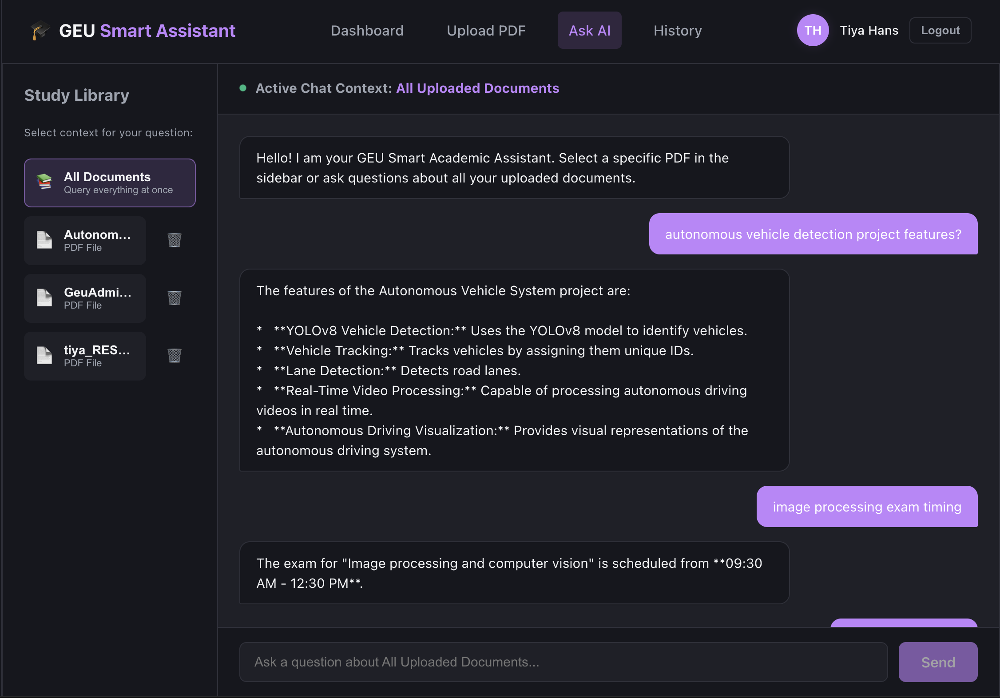
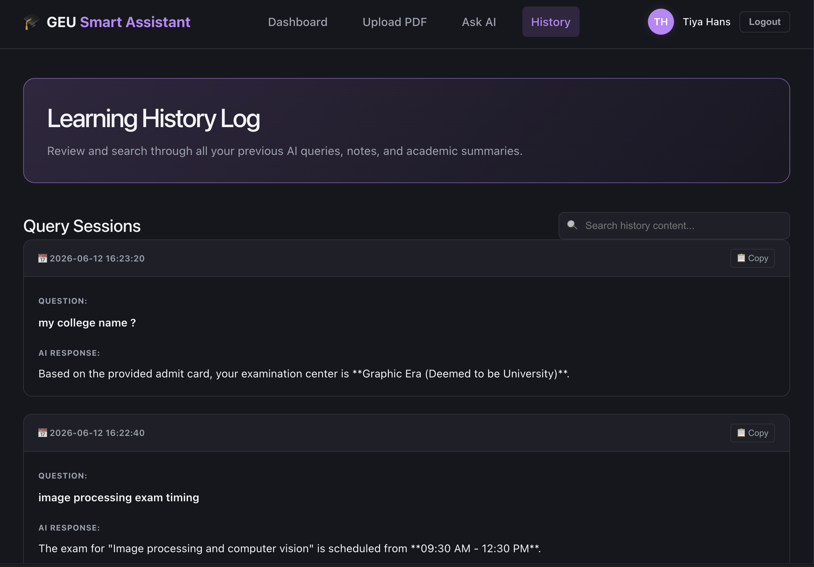

# 🎓 GEU Smart Academic Assistant

An AI-powered Retrieval-Augmented Generation (RAG) academic workspace that enables students to upload study materials, textbook chapters, and lecture notes in PDF format and perform semantic search, ask questions, and receive intelligent answers using Google Gemini AI, LangChain, and ChromaDB.

---

## 📸 Application Screenshots

### 🔐 Login Page



### 📝 Registration Page


### 📊 Dashboard



### 📂 PDF Upload



### 🤖 AI Chat Interface



### 📜 Chat History



---

## 🚀 Key Features

* Secure JWT Authentication
* User Registration & Login
* PDF Upload & Management
* Retrieval-Augmented Generation (RAG)
* LangChain Integration
* ChromaDB Vector Database
* Gemini AI Powered Question Answering
* Semantic Search Across Uploaded Documents
* Multi-Document Query Support
* Chat History Tracking
* Responsive React Dashboard
* Automatic PDF Processing Pipeline

---

## 🛠️ Technology Stack

### Frontend

* React
* Vite
* React Router
* Axios
* CSS

### Backend

* Flask
* Flask-SQLAlchemy
* Flask-JWT-Extended
* Flask-CORS
* bcrypt

### Database

* MySQL
* ChromaDB

### AI & RAG Stack

* Google Gemini AI
* LangChain
* Retrieval Augmented Generation (RAG)
* Gemini Embeddings API
* RecursiveCharacterTextSplitter
* PyPDFLoader

---

## 📂 Project Structure

```bash
GEU_Smart_Assistant/
├── backend/
├── frontend/
├── docs/
│   └── screenshot/
│       ├── login.png
│       ├── register.png
│       ├── dashboard.png
│       ├── upload-pdf.png
│       ├── chat.png
│       └── history.png
└── README.md
```

---

## ⚙️ Environment Variables

Create a `.env` file inside the backend directory:

```env
GOOGLE_API_KEY=your_gemini_api_key
DB_HOST=localhost
DB_USER=root
DB_PASSWORD=your_password
DB_NAME=geu_smart_assistant
JWT_SECRET_KEY=your_secret_key
```

---

## 💻 Installation & Setup

### Backend Setup

```bash
cd backend

python -m venv venv

source venv/bin/activate

pip install -r requirements.txt

python app.py
```

Backend runs on:

```text
http://localhost:5001
```

---

### Frontend Setup

```bash
cd frontend

npm install

npm run dev
```

Frontend runs on:

```text
http://localhost:5173
```

---

## 🔒 Security Features

* Password Hashing using bcrypt
* JWT Authentication
* Protected API Routes
* Environment Variables Management
* User-specific Document Access
* Secure Vector Store Retrieval

---

## 🎯 Future Enhancements

* AI Quiz Generation
* PDF Summarization
* Voice-Based Question Answering
* Multi-Language Support
* Cloud Deployment
* Collaborative Learning Workspace

---

## 👩‍💻 Developer

**Tiya Hans**

B.Tech Computer Science Engineering
Graphic Era University

---

⭐ If you found this project useful, consider giving it a star on GitHub.
